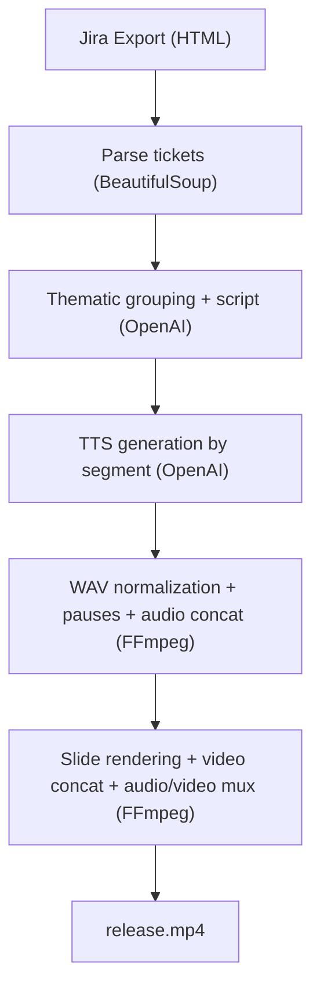

## Release Video Generator from Jira Tickets

This project automates the creation of a product update video from a Jira HTML export.

The idea is to turn technical tickets into a short, readable narrative format through a complete 5-step pipeline:

- parsing Jira tickets,
- thematic grouping and script generation,
- text-to-speech generation for each segment,
- audio normalization and assembly,
- slide rendering and final MP4 export.

## Context & Goals

### Context

Release notes are often too long, inconsistent, and difficult to share with non-technical teams.

This project addresses that need by automatically transforming a Jira export into a narrated video that is easier to consume for:

- product teams,
- developers,
- internal stakeholders,
- and potentially, in the future, end users.

### Goals

- Automatically structure Jira tickets into coherent themes.
- Generate a clear, accurate presentation script suitable for both screen text and voice-over.
- Produce segmented audio narration synchronized with slides.
- Generate a standardized final video (`output/release.mp4`) with no manual editing.

## Pipeline Overview

## Input Data and Artifacts

| Element          | Description                     |
| :--------------- | :------------------------------ |
| Main input       | `data/jira_export.html`         |
| Structured data  | `build/release_structured.json` |
| Generated themes | `build/themes.json`             |
| Video script     | `build/script.json`             |
| Segmented audio  | `audio/*.mp3`                   |
| Final audio      | `build/final_audio.wav`         |
| Timeline         | `build/timeline.json`           |
| Final video      | `output/release.mp4`            |

## Component Details

### 1) Jira Parsing (`src/parse_jira.py`)

- Reads the Jira HTML export using BeautifulSoup.
- Extracts key columns (type, key, summary, created, assignee, reporter, description).
- Currently filters tickets by key prefix (`OPD-`).
- Exports structured JSON for downstream steps.

### 2) Theme and Script Generation (`src/generate_script.py`)

The module runs 2 passes through the OpenAI API:

- **Pass 1**: group tickets into functional themes (classification: `UI`, `API`, or `unspecified`).
- **Pass 2**: generate final slides (intro, thematic slides, conclusion) with:
  - a title,
  - 3 to 5 on-screen bullet points,
  - a 3 to 5 sentence voice-over.

The requested tone is technical, clear, and non-marketing.

### 3) Audio Generation (`src/generate_audio.py`)

- Reads `build/script.json`.
- Generates one MP3 file per segment via `gpt-4o-mini-tts` (voice: `alloy`).
- Names files in sequence (`00_intro.mp3`, etc.).

### 4) Final Audio Track Build (`src/build_audio_track.py`)

- Converts MP3 files into normalized WAV (48kHz, stereo, PCM s16le).
- Inserts silent pauses between segments.
- Concatenates everything into `build/final_audio.wav`.

### 5) Video Rendering (`src/render_video.py`)

- Generates one silent video slide per segment by overlaying text and panels on a background.
- Adjusts each slide duration to match the real audio duration (via `ffprobe`).
- Inserts visual pause segments.
- Concatenates video segments, then muxes the final audio track.
- Produces `output/release.mp4` and a timeline JSON.

### Full Orchestration (`run_all.py`)

The `run_all.py` script automatically chains all 5 steps together with error handling and per-phase logging.

## Technical Stack

- **Language**: Python 3.10+
- **AI (LLM + TTS)**: OpenAI API
- **HTML Parsing**: BeautifulSoup4
- **Audio**: Pydub + FFmpeg
- **Video**: FFmpeg (drawtext, concat, mux)
- **Config**: `python-dotenv` for API key management

## Strengths

- End-to-end, automated, reproducible pipeline.
- Clear separation of responsibilities (dedicated script per step).
- Clean artifact structure (`build/`, `audio/`, `output/`).
- Robust audio/video synchronization through WAV normalization and duration probing.

## Current Limitations

- Strong dependency on the quality of the Jira HTML export.
- Intentionally simple visual layout (static background, no advanced animations).
- OpenAI models and parameters are hardcoded (limited external configuration).
- Ticket filtering currently tied to the `OPD-` prefix.

## Future Improvements

- Configuration file support (models, voices, slide styles, Jira filters).
- Multiple visual templates and rendering themes.
- Automatic subtitle generation.
- Internationalization (configurable narration language).
- CLI packaging for “one command” CI/CD release workflows.
